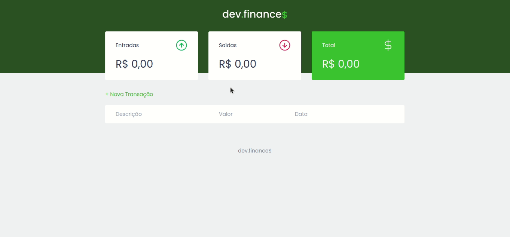

# Dev Finances
[marcoskloss-devfinances.netlify.app](https://marcoskloss-devfinances.netlify.app/) <br>
Dev Finances foi desenvolvido para servir como uma agenda para monitorar suas finanças, persistindo os dados através do localStorage. O projeto foi realizado durante a Maratona Discovery, da Rocketseat, e nele fiz algumas implementações próprias para deixa-lo mais completo.  


### Preview


## Tecnologias Utilizadas
 - JavaScript
 - HTML
 - CSS
### Clonar o projeto via terminal
```sh
    git clone https://github.com/marcoskloss/dev-finances.git
    cd dev-finances
```

#### Mais sobre minha experiência nesse projeto aqui:
[link post linkedin](url)
